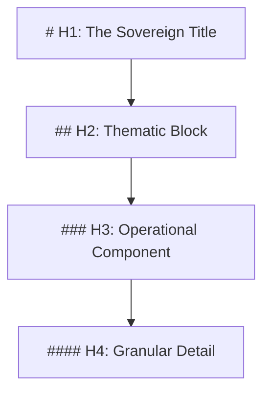

## **Genesis Stamp: 2026-02-01**

<Info>**Domain:** GVRN (Governance) | **State:** CANONIZED | **Version:** v13.0 [ASCENDED]</Info>

## Overview

The **Presentation Protocol** defines the "Physics of Text" for the Synarche.

> **"Clarity is the vehicle of Truth."**

---

## The Hierarchy (H-Structure)

We utilize a strict Semantic Tree logic.

<Warning>**Rule 1**: Only **ONE** `# H1` per file.</Warning>

## Indentation Physics

- **Bulleted Lists**: Use hyphens (`-`).
    - **Nested Items**: Must indent by **4 Spaces**.
- **Numbered Lists**: Use `1.` for all items.

## Visual Identity: Luminous Coherence

All documentation must adhere to the **Luminous Coherence** aesthetic (`UMB-AESTHETIC-001`).

<CardGroup cols={2}>
    <Card title="The Light" icon="sun" color="#34D3FF">
        Primary Accent: **Cyan-400** (`#34D3FF`)
    </Card>
    <Card title="The Structure" icon="shapes" color="#8B5CF6">
        Secondary Accent: **Violet-500** (`#8B5CF6`)
    </Card>
</CardGroup>
