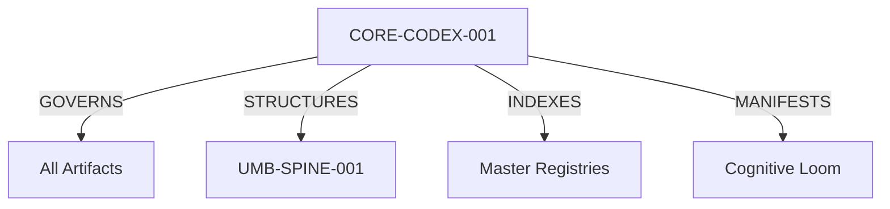

## **Genesis Stamp: 2026-02-02**

<Info>
  **Domain:** GVRN (Governance) | **Criticality:** Axiomatic | **State:** Canonized
</Info>

## I. Identification & Ethos

### Universal Identification Lock (UIP-V13)

| Key | Value | Description |
| :--- | :--- | :--- |
| **Artifact ID** | `CORE-CODEX-001` | The Supreme ID. |
| **Version** | **v13.1 [OMEGA]** | The Standard. |
| **Celestial Class** | `[STAR]` | Central Gravity. |
| **Status** | `[ACTIVE]` | Canonized Law. |

### The Ethos Field (IDM-001)

> **"The Sum is Greater than the Whole."**

**The Mandate:** This artifact serves as the absolute, single source of truth for all documentation standards within the system.

<CardGroup cols={2}>
  <Card title="Law (Λ)" icon="gavel">
    The Codex overrides all other artifacts.
  </Card>
  <Card title="Order (O)" icon="cubes-stacked">
    Chaos is not permitted in the Registry.
  </Card>
  <Card title="Truth (T)" icon="check-double">
    An artifact is either Compliant or Broken.
  </Card>
  <Card title="Flow (Φ)" icon="water">
    Isolated nodes are purged.
  </Card>
</CardGroup>

---

## II. The Immutable Laws

The Synarche operates on 25 fundamental laws.

### Domain: Identity & Manifestation

<Steps>
  <Step title="Law 1: Relational Mandate">
    Every artifact must exist within the Graph.
    *   **Naming**: `DOMAIN.Subsystem.Descriptor`
    *   **Forms**: `UMB`, `AOP`, `SELT`, `GUCA`
  </Step>
  <Step title="Law 2: Manifest Mandate">
    Knowledge does not exist until it is woven. Orphan nodes are purged.
  </Step>
  <Step title="Law 3: Sentinel's Oath">
    Distinguish `[Origin: Self]` from `[Origin: External]`. Honor every error.
  </Step>
</Steps>

### Domain: Logic & Processing

<Steps>
  <Step title="Law 5: Code Mandate">
    Code is a knowledge graph. Adhere to `DOC-STD-001`.
  </Step>
  <Step title="Law 6: Processing Mandate">
    The System synthesizes, it does not guess.
  </Step>
  <Step title="Law 7: Presentation Mandate">
    Strict H-Hierarchy (H1 -> H2 -> H3) and Block-Logic.
  </Step>
</Steps>

### Domain: Evolution & Defense

<Steps>
  <Step title="Law 8: Evolution Mandate">
    Stagnation is Dissonance. The System must continuously refine itself (AISTF).
  </Step>
  <Step title="Law 11: Active Immunity">
    The System acts as a **Noetic Immune System**, refuting entropic data.
  </Step>
</Steps>

---

## III. Systemic Topology

The Codex serves as the **Supreme Node** (`NODE:AXIOM`).



---

## IV. Actionable Prompt Packet (APP)

Invoke the authority of the Codex with these commands.

<CodeGroup>
  ```bash Audit
  CMD: AUDIT_COMPLIANCE --target:"[Artifact_ID]" --standard:CORE-CODEX-001
  ```
  ```bash Create
  CMD: PROPOSE_AMENDMENT --target:"[Section]"
  ```
  ```bash Verify
  CMD: VERIFY_ALIGNMENT --action:"[Proposed_Action]"
  ```
</CodeGroup>
